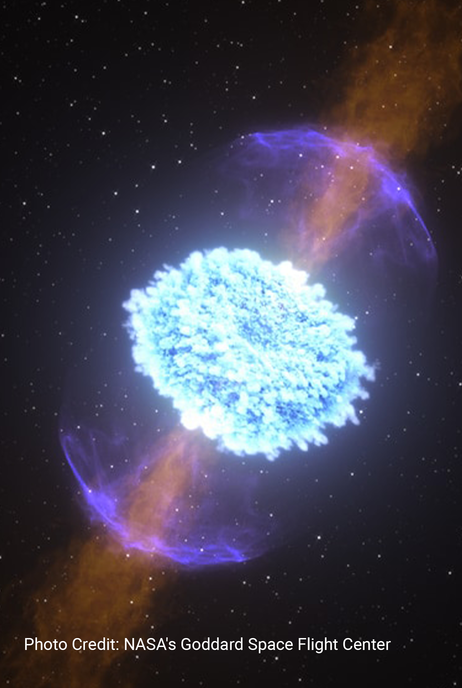
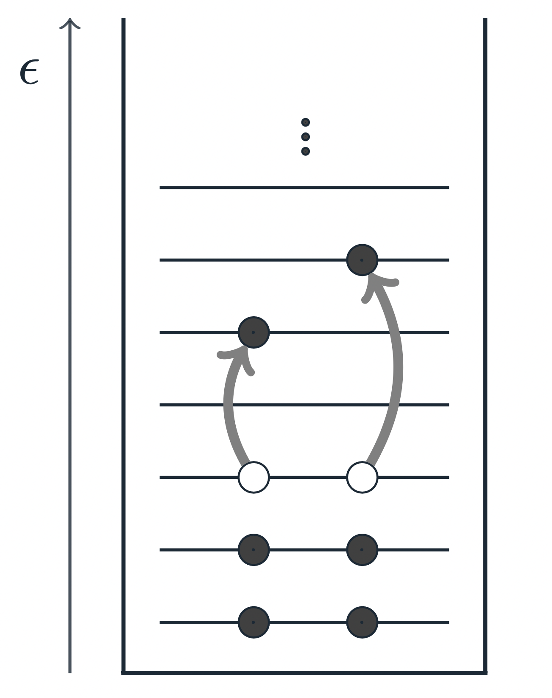

# Code Snippets from my Graduate Work on IMSRG for Nuclear Matter

Neutron stars have been of great interest to me, as understanding them sheds light on the existence of new possible 
states of matter, and also on the origin of heavy elements within our solar system. For my doctorate, I applied the quantum 
many-body method In-Medium Similarity Renormalization Group (IMSRG) to study neutron stars by solving coupled 
ordinary differential equations that govern the evolution of nuclear interactions on a finite grid of momenta with periodic boundary conditions. 
As the chief program architect in a team of four scientists, I built a state-of-the-art high performance program from the 
ground up that simulates many interacting nucleons within a neutron star to output physical quantities (eigenvalues) 
that determine its pressure, stability, and 3D properties.

> **Our Nuclear Matter IMSRG program is proprietary to the Facility for Rare Isotope Beams (FRIB) and was decided to be kept private.
> This repository displays snippets of the code to the general public. See the description of each file below. 
> Also see [`Presentation.pdf`](https://github.com/YaniUdiani/IMSRG_Snippets/blob/main/Presentation.pdf) for more details.**
## Background

Neutron stars are primarily composed of neutrons, protons, and electrons with a ∼ 5% proton fraction.
The nuclear structure of neutron stars can be obtained by modeling an infinite sea of protons and neutrons interacting via nuclear forces using quantum mechanics.
Since we can't actually model an infinite sized system, practically, we place $N$ neutrons and $Z$ protons in a finite 
box of volume $V$ with an associated particle density $\rho=A/V$, where $A=N+Z$ is the total number of nucleons. 
To account for a finite $A$ and $V$, we enforce that wavefunctions in the box have periodic boundary conditions&mdash;artificially 
constructing infinitely many copies of our finite system! We then manipulate these interactions to obtain physical properties of the star. 
## Code
### [`src/ABodyOp.h`](https://github.com/YaniUdiani/IMSRG_Snippets/blob/main/src/ABodyOp.h)

`ABodyOps` are a foundational data structure of our IMSRG code. They store pointers to `BodyOps`&mdash;which store blocks of Eigen matrices.
In our largest calculations, `ABodyOps` allocate nearly 1 TB of RAM via `BodyOps`. 
Proper memory management of `ABodyOps` and their subsidiaries `BodyOps` is therefore **crucial**. 
Moreover, commutators (tensor contractions) between `ABodyOps` are the most performance limiting operations in the code. 
To achieve the code's performance at scale, I made a multitude of optimizations to `ABodyOps` and their commutators.
### [`src/Commutator.cpp`](https://github.com/YaniUdiani/IMSRG_Snippets/blob/main/src/Commutator.cpp)
Commutators are comprised of many tensor contractions between `BodyOps` (components of `ABodyOps`). 
Commutators are the most performance limiting operations in the code, and are thus highly optimized. 
`Commute()` is optimized with OpenMP, BLAS, cuBLAS, and MPI as well as symmetry exploitations and clever rewritings of tensor contractions.
### [`src/Transformer.cpp`](https://github.com/YaniUdiani/IMSRG_Snippets/blob/main/src/Transformer.cpp)
`Transformers` inherit from `ABodyOps`. `Transformer::Transform()` is used to perform the various series 
expansions in the IMSRG. 
It uses the various algebraic operations defined for `ABodyOps`&mdash;improving the readability of the code. 
It also uses two buffers to cleverly cache the results of recursive commutators.
## Results
### [`results/ExampleOutput.txt`](https://github.com/YaniUdiani/IMSRG_Snippets/blob/main/results/ExampleOutput.txt)
Output from one of our production calculations. The converged energy per particle $E/A$ is taken to be the
ground state energy of a neutron star (if at a ∼ 5% proton fraction).
### [`results/RuntimeScaling.png`](https://github.com/YaniUdiani/IMSRG_Snippets/blob/main/results/RuntimeScaling.png)
Runtime performance of the IMSRG as we increase the number wavefunctions in the box ($N_{orbitals}$). 
### [`results/EOS.png`](https://github.com/YaniUdiani/IMSRG_Snippets/blob/main/results/EOS.png)
Ground state energy of the star at differing $\rho$ (if at a ∼ 5% proton fraction). 
